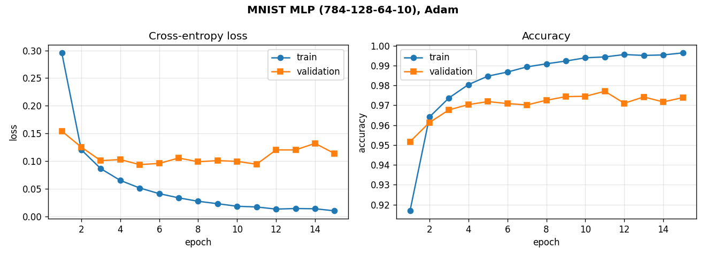
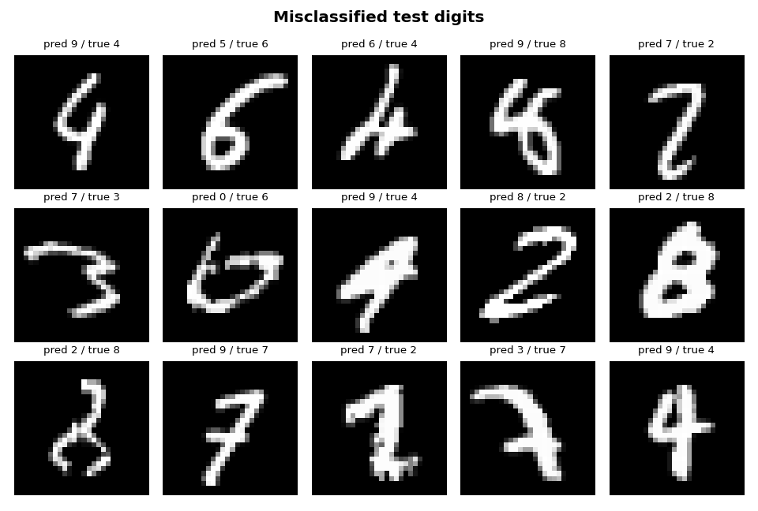

# mnist_nn — a NumPy-only neural network framework

[](https://github.com/nathanaelhub/mnist-numpy-nn/actions/workflows/ci.yml)
[](LICENSE)
[](https://www.python.org/)

A small, modular, object-oriented neural network library built with **nothing but
NumPy** — dense *and* convolutional layers, SGD/Adam, dropout, and a
finite-difference-tested autodiff-free backprop — plus scripts that classify the
MNIST handwritten digits.

- A 2-layer MLP reaches **~95% test accuracy in 2 epochs** (a few seconds on CPU).
- A deeper MLP (`784-128-64-10`) reaches **~97.5%** in 15 epochs.
- A small CNN reaches **~99%** with full-data training.

## Results

A `784-128-64-10` MLP trained with Adam for 15 epochs (`python plot_results.py`):



The train/validation gap that opens after a few epochs is textbook mild
overfitting — exactly what the `Dropout` layer is there to curb. The digits the
model still gets wrong are mostly genuinely ambiguous:



## Layout

```
mnist_nn/
├── nn/
│   ├── layers.py       # Layer base class; Dense, Activation, Dropout
│   ├── conv.py         # Conv2D, MaxPool2D, Flatten (im2col convolution)
│   ├── losses.py       # Loss base class; MSE and CrossEntropy
│   ├── optimizers.py   # Optimizer base class; SGD (+momentum) and Adam
│   ├── network.py      # Network: add / compile / fit / predict / evaluate
│   └── progress.py     # dependency-free terminal progress bar
├── data/
│   └── mnist_loader.py # downloads + caches mnist.npz, builds train/val/test
├── tests/
│   └── test_nn.py      # finite-difference gradient checks + behaviour tests
├── train.py            # MLP training CLI
├── train_cnn.py        # CNN training CLI
├── plot_results.py     # saves training curves + misclassified-digit grid
└── README.md
```

## Quick start

```bash
python train.py                                  # Adam, 1 hidden layer, 10 epochs
python train.py --hidden 256 128 --epochs 20     # deeper net
python train.py --optimizer sgd --lr 0.1         # SGD + momentum
python train.py --loss mse                       # MSE head (sigmoid output)
python train.py --hidden 256 --dropout 0.3       # dropout regularisation

python train_cnn.py                              # CNN on an 8k subset (quick)
python train_cnn.py --full --epochs 5            # full data, ~99% accuracy
```

The first run downloads MNIST (~11 MB) to `data/mnist.npz` and reuses it afterward.
Pre-download without training with `python -m data.mnist_loader`.

## Design

Every **layer** implements `forward(x, training=False)` and `backward(grad)`. The
forward pass caches whatever the backward pass needs; the backward pass returns
`dL/d(input)` and, for parameterised layers, stores `dL/d(param)` on the layer.
An **optimizer** then walks each layer's `params_and_grads()` and updates the
arrays in place. The `training` flag lets stochastic layers behave differently
at train vs. inference time — `fit` passes `training=True`, while `predict` /
`evaluate` pass `training=False`.

- **`Dense`** — affine `y = x·W + b`, with He or Xavier initialisation.
- **`Activation`** — one configurable class for `"relu"`, `"sigmoid"`, `"softmax"`.
  Softmax uses the exact Jacobian-vector product in its backward pass, so it
  composes correctly with *any* loss (not just cross-entropy).
- **`Dropout`** — inverted dropout: zeros a fraction of activations and rescales
  the survivors during training; the identity at inference.
- **`Conv2D` / `MaxPool2D` / `Flatten`** — convolutional stack over `(N, C, H, W)`
  tensors. `Conv2D` uses the *im2col* trick (each receptive field unrolled into a
  row) so convolution and its gradient are single matrix multiplies — fully
  vectorised, no Python loops over pixels.
- **`CrossEntropy`** — for one-hot targets over softmax probabilities. Combined
  with the softmax layer the gradient reduces cleanly to `(p − y) / N`.
- **`MSE`** — mean squared error, batch-averaged.
- **`SGD`** — with optional classical momentum. **`Adam`** — bias-corrected.

Correctness is checked against finite-difference gradients (agreement to ~1e-12).

## Tests

```bash
pip install -r requirements-dev.txt
python -m pytest          # 29 tests: per-layer + whole-network gradient checks
                          # (Dense, conv, pool, activations, losses), dropout
                          # behaviour, and end-to-end learning
```

CI runs the suite on Python 3.9–3.12 on every push (see the badge above).

Every layer and loss is verified by comparing its analytic gradient to a
central finite-difference estimate of the same scalar loss — including the
`Conv2D` and `MaxPool2D` backward passes.

## Library use

```python
import numpy as np
from nn import Network, Dense, Activation, Adam, CrossEntropy
from data import load_data

(X_tr, y_tr), (X_val, y_val), (X_te, y_te) = load_data()

net = Network()
net.add(Dense(784, 128)); net.add(Activation("relu"))
net.add(Dense(128, 10));  net.add(Activation("softmax"))
net.compile(loss=CrossEntropy(), optimizer=Adam(lr=1e-3))

net.fit(X_tr, y_tr, epochs=10, batch_size=64, validation_data=(X_val, y_val))
print("test accuracy:", net.evaluate(X_te, y_te)[1])
```

## Requirements

Python 3.9+ and NumPy — no other runtime dependencies.
```bash
pip install -r requirements.txt        # runtime (numpy)
pip install -r requirements-dev.txt    # + pytest, to run the tests
pip install matplotlib                  # only for plot_results.py
```

## License

[MIT](LICENSE).
